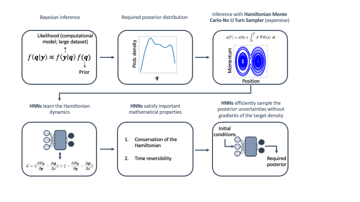

Copyright (c) 2022 Battelle Energy Alliance, LLC

Licensed under MIT License, please see LICENSE for details

https://github.com/IdahoLabResearch/BIhNNs/blob/main/LICENSE

# BIhNNs

BIhNNs: Bayesian Inference with (Hamiltonian and other) Neural Networks

* Train neural network architectures like deep neural nets (DNN), Neural ODEs, Hamiltonian neural nets (HNNs), and symplectic neural nets to learn probability distribution spaces.
* Use the trained neural net to perform sampling without requiring gradient information of the target probability density.
* State-of-the-art sampling schemes like Langevin Monte Carlo, Hamiltonian Monte Carlo, and No-U-Turn Sampling are available for use with the above-mentioned trained neural nets.

# Publications

The code in this repository is part of the following two papers available on arXiv:

* Dhulipala et al. (2022) Bayesian Inference with Latent Hamiltonian Neural Networks. https://arxiv.org/abs/2208.06120.
* Dhulipala et al. (2022) Physics-Informed Machine Learning of Dynamical Systems for Efficient Bayesian Inference. https://arxiv.org/abs/2209.09349.

The below figure presents the workflow for performing sampling with (Hamiltonian and other) neural networks.

# Using the code

# Author information

Som L. Dhulipala 

Computational Scientist in Uncertainty Quantification

Computational Mechanics and Materials

Email: Som.Dhulipala@inl.gov 

Idaho National Laboratory